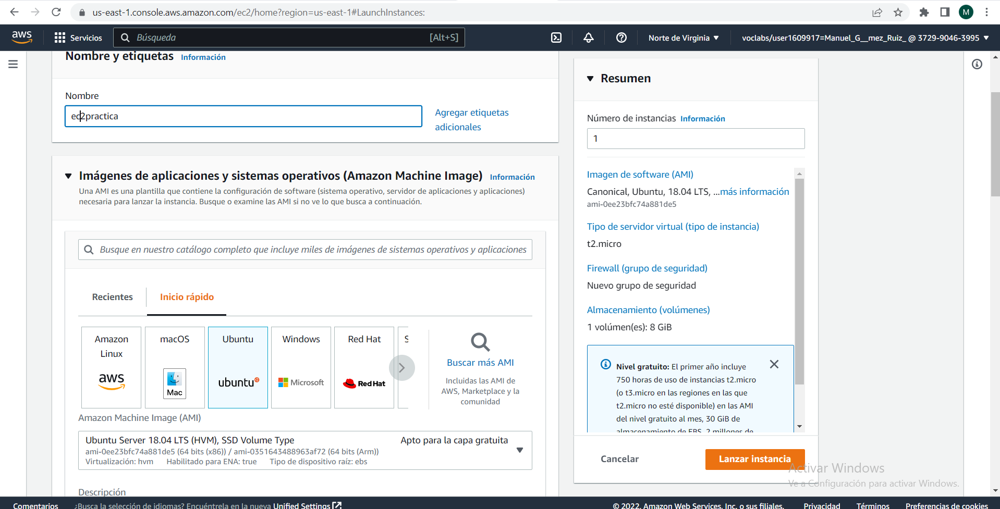
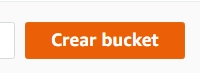
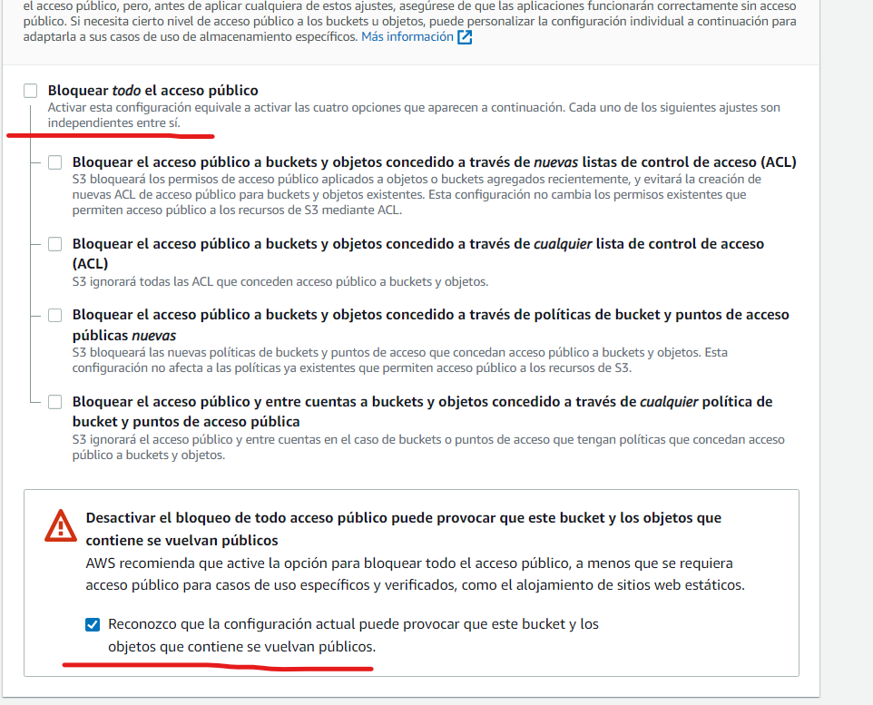
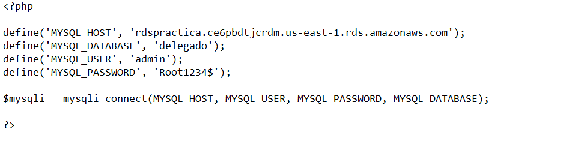
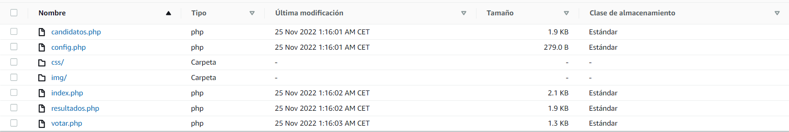
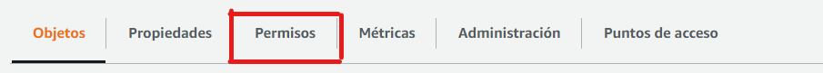
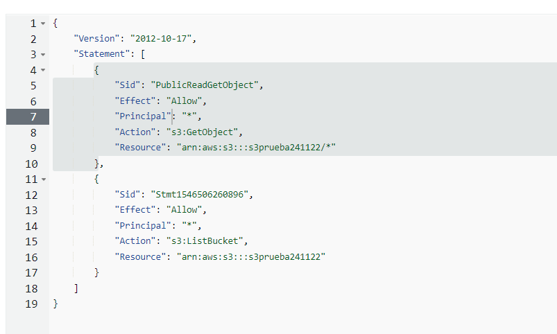

# Práctica 3.9: Despliegue web con bases de datos en AWS. Nivel básico.
#### Jesús Pablo Barba Reyes, Manuel Gómez Ruiz, Adrian Baeza Rodríguez

## EC2

1. Nos vamos a servicios y allí escribimos EC2.

2. Le damos a Lanzar instancia y definimos los datos de nuestra máquina EC2 como su AMI(en este ejemplo vamos a usar Ubuntu 18), nombre, reglas de seguridad, VPC, como está en la imagen.

    

    .png)

1. Descargamos el par de claves de la máquina para poder acceder por SSH y habilitamos los puertos 22(SSH) y 443(HTTPS) a través de las reglas de entrada.

2. En el panel desplegable de EC2, buscamos y seleccionamos IP elástica, creando y asociando esa IP elástica con la máquina para que la dirección pública sea estática.

3. Accedemos desde la terminal por SSH a la máquina EC2, en el apartado Conectar de nuestra máquina tenemos el comando para hacerlo, con el comando en el repositorio donde tengamos la clave privada de la máquina podríamos acceder a ella.

4. Una vez accedemos instalamos Apache con los siguientes comandos:
   
    - sudo apt update (actualizar repositorios)
    - sudo apt install apache2

    Y comprobamos que se ha instalado correctamente: 
    
   - sudo systemctl apache2

5. Instalamos el cliente de AWS.

   - sudo apt install awscli

6. ( Antes revisar la parte de s3 disponible mas abajo) Sincronizamos la máquina EC2 con la máquina S3( ARN del bucket) con el siguiente comando: 

    - sudo aws s3 sync s3://names3 /var/www/html

    

7. Instalamos los paquetes necesarios para que el navegador pueda interpretar el código PHP.

    - sudo apt install php libapache2-mod-php php-mysql

8. Por último , cogeremos nuestra ip publica de la ec2 y la introducimos en el navegador web y añadimos /index.php de manera que quedaria algo asi "52.4.253.189/index.php"

## RDS

## S3

1. Nos iriamos a servicios , dentro de servicios buscamos Almacenamiento y entraremos en el apartado que pone s3 

    

2. Dentro de la parte de buckets crearemos uno

    

3. Escribiremos un nombre unico , seguido nos vamos a la configuración de bloqueo de acceso público para este bucket y desmarcamos la parte de bloquear todo el acceso público

    

4. Los demas apartados los dejamos igual y creamos el bucket

5. Nos vamos a nuestra carpeta del juego y buscamos el archivo "config.php" y lo edtiamos con un editor de texto y escribiremos nuestras credenciales

    

6. Ahora subiremos el juego, para ello nos vamos a nuestro bucket y abrimos el apartado de "cargar". Dentro pegaremos los archivos del juego
   
   

7. Por ultimo , en nuestro bucket nos vamos a la pestaña de permisos. Dentro nos vamos al apartado de "Política de bucket" , le damos a editar y agregamos las siguientes dos instrucciones 

    **Nota:** **Debemos poner nuestro ARN del bucket**

    

    

**Ahora nos vamos al paso 8 de la EC2**