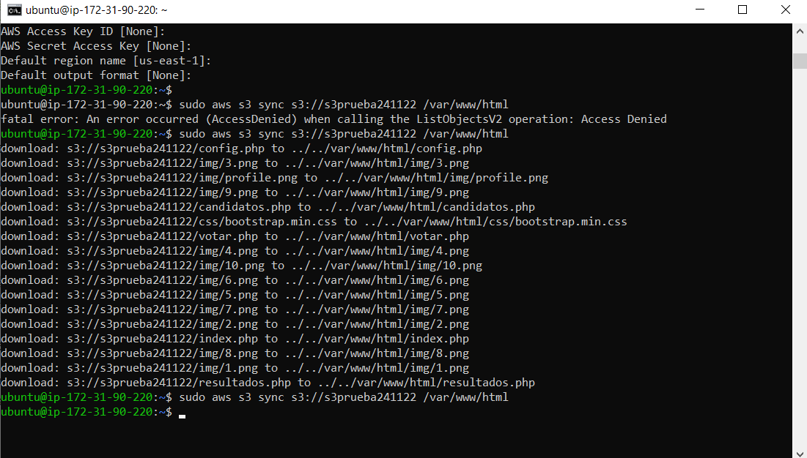
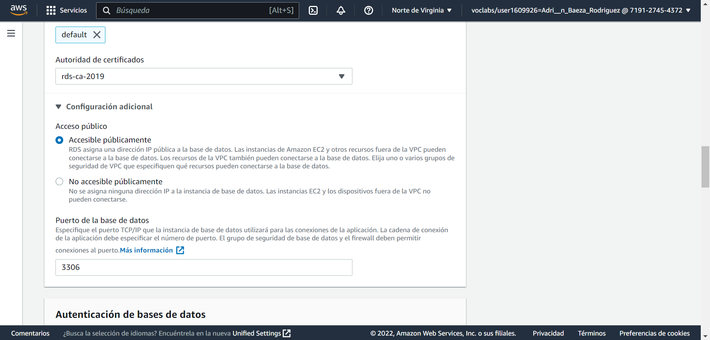
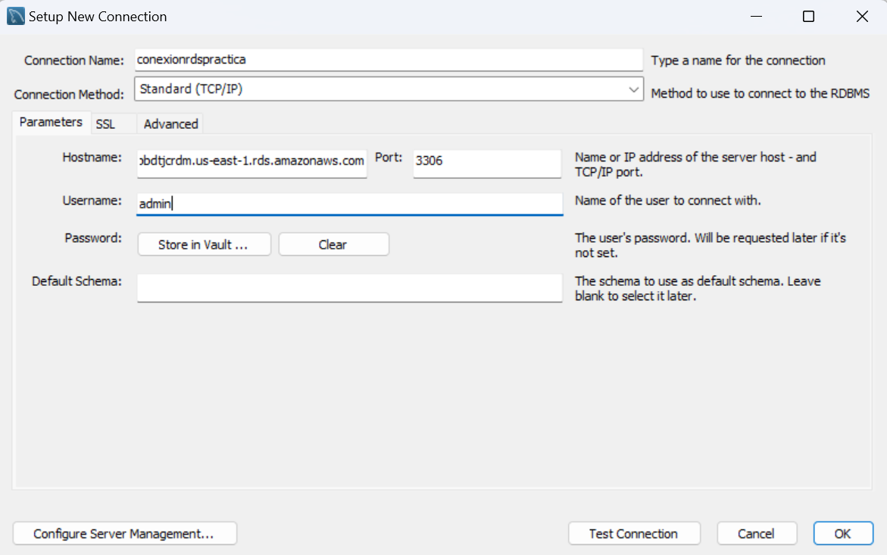
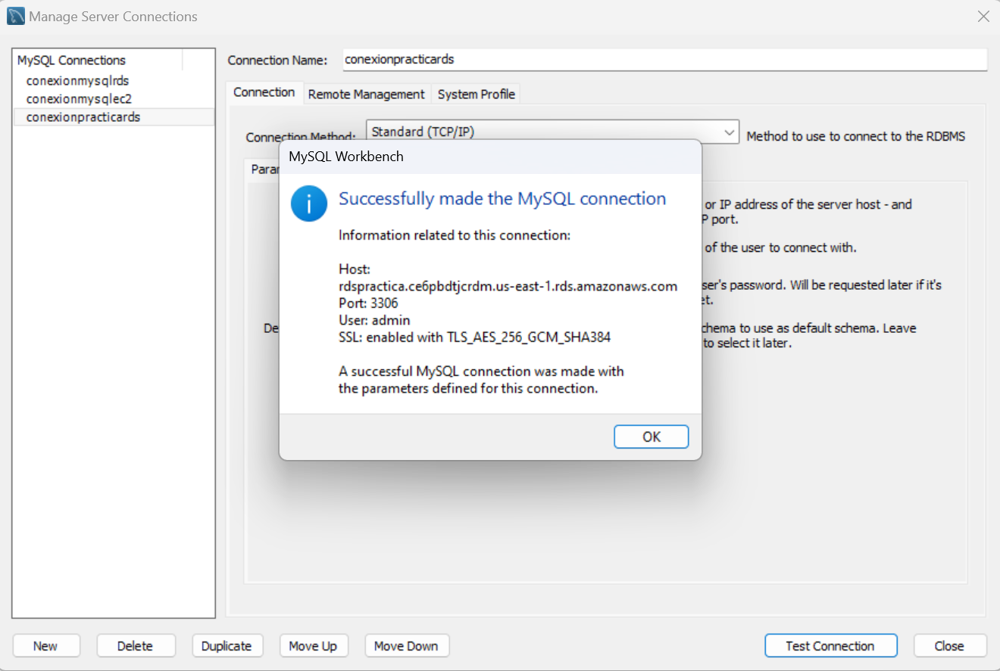
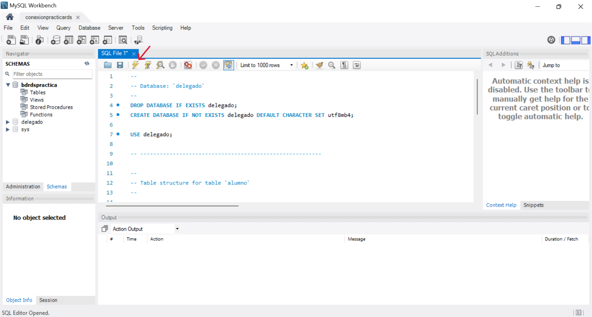
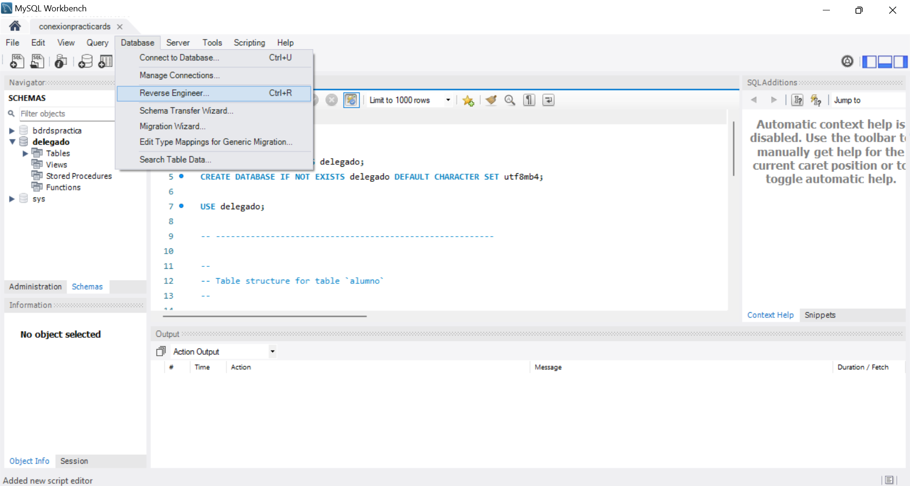
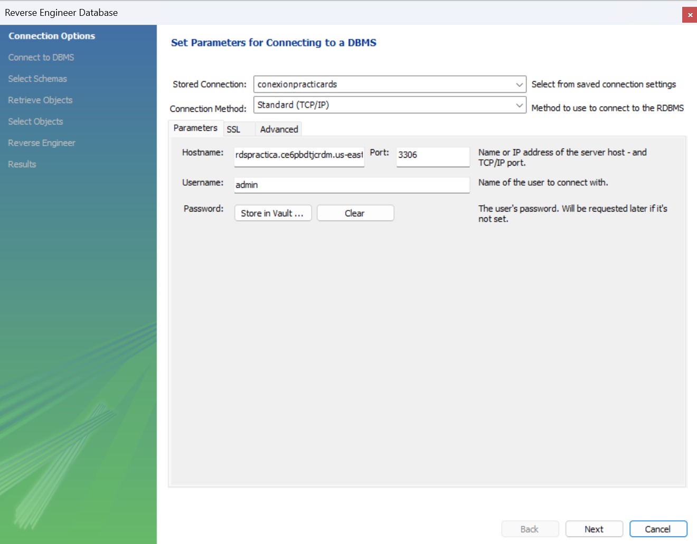
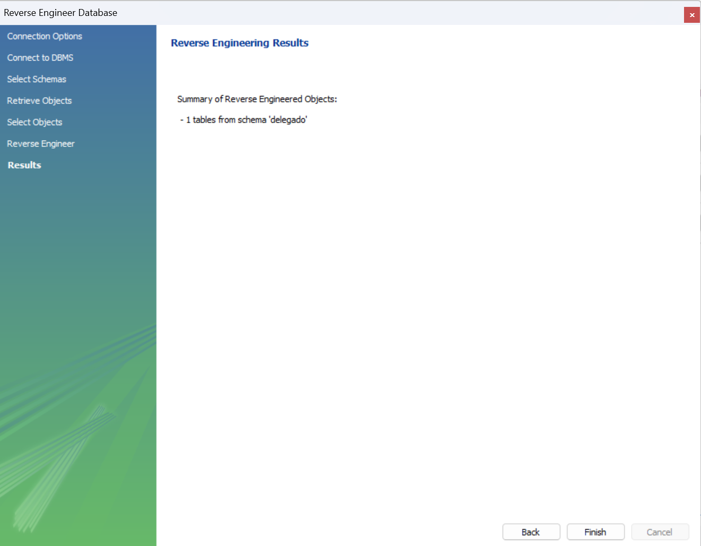
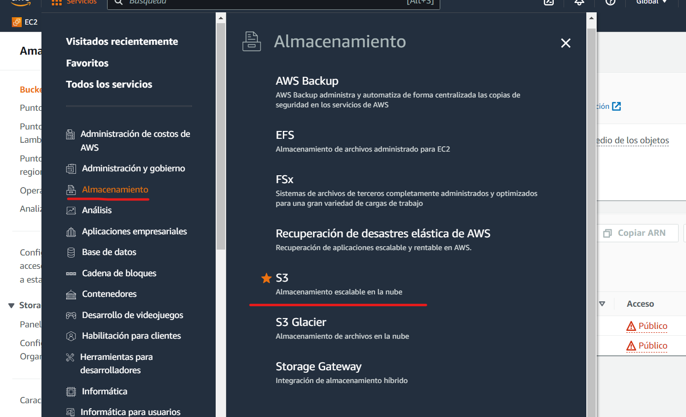

# Práctica 3.9: Despliegue web con bases de datos en AWS. Nivel básico.
#### Jesús Pablo Barba Reyes (S3), Adrian Baeza Rodríguez (RDS), Manuel Gómez Ruiz (EC2)

## EC2

1. Nos vamos a servicios y allí escribimos EC2.

2. Le damos a Lanzar instancia y definimos los datos de nuestra máquina EC2 como su AMI(en este ejemplo vamos a usar Ubuntu 18), nombre, reglas de seguridad, VPC, como está en la imagen.

    

    .png)

1. Descargamos el par de claves de la máquina para poder acceder por SSH y habilitamos los puertos 22(SSH) y 443(HTTPS) a través de las reglas de entrada.

2. En el panel desplegable de EC2, buscamos y seleccionamos IP elástica, creando y asociando esa IP elástica con la máquina para que la dirección pública sea estática.

3. Accedemos desde la terminal por SSH a la máquina EC2, en el apartado Conectar de nuestra máquina tenemos el comando para hacerlo, con el comando en el repositorio donde tengamos la clave privada de la máquina podríamos acceder a ella.

4. Una vez accedemos instalamos Apache con los siguientes comandos:
   
    - sudo apt update (actualizar repositorios)
    - sudo apt install apache2

    Y comprobamos que se ha instalado correctamente: 
    
   - sudo systemctl apache2

5. Instalamos el cliente de AWS.

   - sudo apt install awscli

6. ( Antes revisar la parte de s3 disponible mas abajo) Sincronizamos la máquina EC2 con la máquina S3( ARN del bucket) con el siguiente comando: 

    - sudo aws s3 sync s3://names3 /var/www/html

    

7. Instalamos los paquetes necesarios para que el navegador pueda interpretar el código PHP.

    - sudo apt install php libapache2-mod-php php-mysql

8. Por último , cogeremos nuestra ip publica de la ec2 y la introducimos en el navegador web y añadimos /index.php de manera que quedaria algo asi "52.4.253.189/index.php"

## RDS

1. Vamos a crear una base de datos en AWS. Seleccionamos crear nueva base de datos. Configuraremos la instancia de la siguiente forma:

   - Versión del motor: seleccionamos MySQL, en la versión que aparece por defecto (8.0.28).
   - Plantillas: seleccionamos la capa gratuita.
   - Configuración: como identificador de instancia en este caso introducimos el nombre "rdspractica", como nombre de usuario introducimos "admin" y como contraseña maestra "Root1234$".
   - Almacenamiento: seleccionamos SSD de uso general (gp2), que es la que aparece por defecto.
   - Conectividad: seleccionaremos que no se conecte a un recurso informático EC2. En tipo de red seleccionamos IPv4, para comunicar los recursos solo por IPv4. Como VPC seleccionamos la que aparece por defecto ("default"). En configuración adicional, permitimos el acceso público para poder conectarnos desde instancias externas. En el puerto de la base de datos, introduciremos el 3306.

        

2. Posteriormente, creamos la base de datos.

    Lo siguiente que hay que realizar es configurar el Workbench con el Host de ésta RDS, para comprobar que funciona la conexión y subir la tabla "delegados". Configuramos una nueva conexión de la siguiente manera:

    

    Donde en nombre de conexion introducimos, en este caso, "conexionpracticards", en Hostname tenemos que introducir el Host de nuestra RDS de Amazon, en Username introducimos "admin" y guardamos la contraseña "Root1234$". A continuación seleccionamos "Test Connection", y nos debe aparecer una ventana que indica que funciona correctamente, como se muestra a continuación:

    

    Una vez iniciado el Workbench, debemos crear un nuevo archivo sql, y pegar el código del archivo "delegado.sql". Transformamos el SQL (pulsando sobre el icono del rayo) como se muestra a continuación, para que aparezca la tabla:

    

    Una vez tengamos la tabla, subiremos el contenido a la base de datos de la nube, accediendo a Database --> Reverse Engineer:

    

    En la ventana que nos aparece introducimos los parámetros de nuestra conexión, como se muestra a continuación:

    

    Seguimos los pasos, seleccionamos la base de datos que queremos subir (en este caso "delegado"), y finalmente nos debe aparecer de la siguiente forma:

    

    Aquí se muestra que se ha subido la tabla del esquema "delegado". Finalizamos y ya tendríamos lista la RDS.

## S3

1. Nos iriamos a servicios , dentro de servicios buscamos Almacenamiento y entraremos en el apartado que pone s3 

    

2. Dentro de la parte de buckets crearemos uno

    

3. Escribiremos un nombre unico , seguido nos vamos a la configuración de bloqueo de acceso público para este bucket y desmarcamos la parte de bloquear todo el acceso público

    

4. Los demas apartados los dejamos igual y creamos el bucket

5. Nos vamos a nuestra carpeta del juego y buscamos el archivo "config.php" y lo edtiamos con un editor de texto y escribiremos nuestras credenciales

    

6. Ahora subiremos el juego, para ello nos vamos a nuestro bucket y abrimos el apartado de "cargar". Dentro pegaremos los archivos del juego
   
   

7. Por ultimo , en nuestro bucket nos vamos a la pestaña de permisos. Dentro nos vamos al apartado de "Política de bucket" , le damos a editar y agregamos las siguientes dos instrucciones 

    **Nota:** **Debemos poner nuestro ARN del bucket**

    

    

**Ahora nos vamos al paso 8 de la EC2**